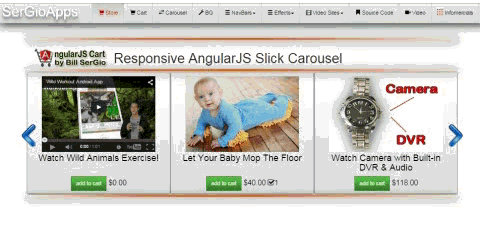
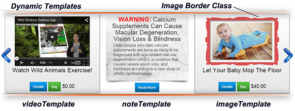
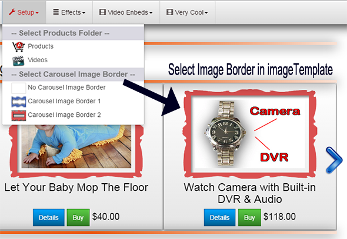
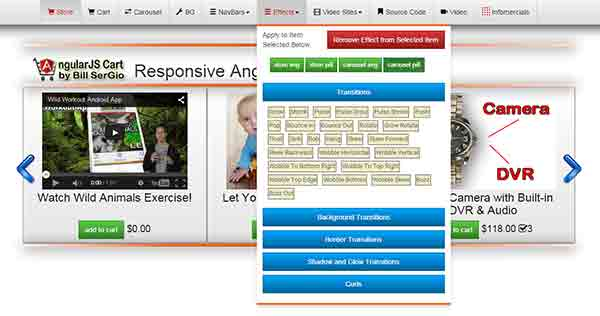
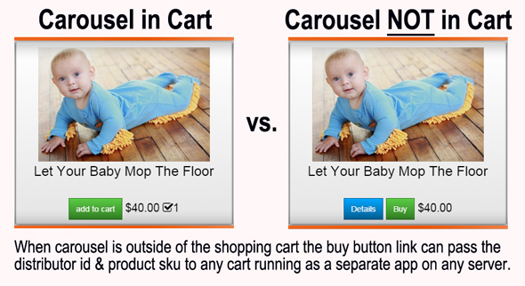
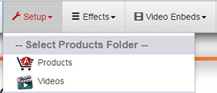

# Angular Super Slick Carousel
This is the BEST Angular Carousel on the Web -- Try It and See for Yourself

<!-- Start Article -->

<ul class="download">
	<li><a href="http://www.codeproject.com/KB/HTML/895739/AngularSuperSlickCarousel.zip">Download AmgularSuperSlickCarousel.zip - 8.6 MB</a></li>
</ul>

<h4><a href="http://www.SerGioApps.com/storefront.html" target="_blank">Click Here to See A Working Demo of My Angular Super Slick Carousel</a></h4>

<h4><a href="http://www.software-rus.com/" target="_blank">Click Here to My Other FREE Source Code Projects</a></h4>

<table>
	<tbody>
		<tr>
			<td></td>
			<td>&nbsp;&nbsp;</td>
			<td>
			<h3 style="text-align: center;"><strong>Swipe works perfectly 
			on all mobile devices</strong></h3>

			<h3 style="text-align: center;"><strong>Works as 
			Web App on Server 
			or 
			in an AngularJS 
			PhoneGap App</strong></h3>
			</td>
		</tr>
	</tbody>
</table>

<h2>Introduction</h2>

I wanted to add a Carousel to my <em>AngularJS Shopping Cart</em> that you can see in my article&nbsp;<a href="http://www.codeproject.com/Articles/881354/A-Responsive-Mobile-Shopping-Cart-Using-AngularJS" target="_blank"><em>Responsive Mobile Shopping Cart Using AngularJS</em></a> that I posted here on CodeProject last month. However I wanted a carousel that can be used either inside or outside of a shopping cart and that had the following features:

<ul>
	<li>Uses AngularJS <strong><em>Dynamic Templates</em></strong> for Pills: Images, Videos and Notes&nbsp;</li>
	<li><em><strong>Plays Videos from ALL Tubes Sites that allow EMBED, e.g. YouTube, YouKu, Vimeo, etc.</strong></em></li>
	<li>Ability to easily create an AngularJS Directive for the Carousel</li>
	<li><em><strong>Fully Responsive for Mobile</strong></em>. Scales with its container.</li>
	<li>Separate settings per breakpoint</li>
	<li>Uses CSS3 when available. Fully functional when not.</li>
	<li><em><strong>Swipe Enabled</strong></em> for Mobile. Or disabled, if you prefer.</li>
	<li>Desktop mouse dragging</li>
	<li>Infinite looping.</li>
	<li>Fully accessible with arrow key navigation</li>
	<li>Add, remove, filter &amp; unfilter slides</li>
	<li>Autoplay, dots, arrows, callbacks, etc...</li>
</ul>

To accomplish this I looked at a lot of carousels and the nicest looking carousel with the above features was a JQuery plugin-in by <em>Ken Wheeler</em> called <em><strong>Slick</strong></em>. You can see the JQuery plugin-in at: <a href="https://github.com/kenwheeler/slick" target="_blank">https://github.com/kenwheeler/slick</a>&nbsp; And there was already an&nbsp;AngularJS Directive for the Slick Carousel by&nbsp;<em>Vasyl Stanislavchuk</em>&nbsp;that I found at: <a href="https://github.com/vasyabigi/angular-slick" target="_blank">https://github.com/vasyabigi/angular-slick</a>

The project in this article is a modified version I created of <em>Vasyl Stanislavchu's</em> Angular Directive for the Slick Carousel that includes other features I added that are needed to allow dynamic creation of the carousel on window resize, pill blocks with images, videos, text and Bootstrap 3 buttons with gradients that can be individually animated with hover effects. The <em>AngularJS Super Slick Carousel</em> in this article can be used as either a stand-alone carousel with or without products or you can add it to my AngularJS Shopping Cart by just dropping in the code. I wanted to keep the code for the carousel separate from just including it in the shopping cart because there are a lot of people who believe that carousels kill sales. I am not going to get involved in teh debate or pro or con carousels.&nbsp;

<h2>AngularJS <em>Super Slick Carousel</em>&nbsp; Features</h2>

The full collection of features in the <em>Super Slick Carousel</em> are too numerous to list but you can see all of the included features and how to set them&nbsp;<a href="https://github.com/kenwheeler/slick/" target="_blank">here</a>.&nbsp; 

I used <strong>Bootstrap 3 </strong>but <strong>NOT </strong><em>ui.bootstrap</em>&nbsp;because ui.bootstrap gives me headaches trying to keep up with their changes. <strong>Bootstrap 3</strong> has <em><strong>navbars </strong></em>where it easy to change the look-and-feel of the navbars from in side your app using AngularJS as demonstrated below in the shopping cart. To create the gradient in these navbars I used the gradient editor at: <a href="http://www.colorzilla.com/gradient-editor/" target="_blank">http://www.colorzilla.com/gradient-editor/</a>.​&nbsp;

There are several ways to setup the carousel's default setting. In the html code we can hard code settings, or set them to a variable as in teh case of using&nbsp;

<pre>// In config.js file we set the value:&nbsp; 
&nbsp; '<strong>CF_CAROUSEL_AUTO_PLAY</strong>': true,</pre>

as used in the Slick declaration below in the html. where the value of <strong>CAROUSEL_AUTO_PLAY</strong> is set in the config,js file in the ac_products directory. Please note that you can add any other setup parameters you want to this config.js file and then use them in the html declaration like I did for autoplay="<strong>CAROUSEL_AUTO_PLAY</strong>" as shown below.

<pre>&lt;slick id="storeslider" ng-if="dataLoaded" autoplay="<strong>CAROUSEL_AUTO_PLAY</strong>" init-onload="false" data="dataLoaded" slick-apply='slickApply' slides-to-show=3 slides-to-scroll=1 class="col-md-12 slider responsive multiple-items center-wrapper"&gt; ...</pre>

I added another way of setting the defaults the <strong>directive</strong> as shown below for responsive setting to allow the AngularJS to display correctly on mobile devices. As shown below you can see how to set the responsive proties you want based upon window size.

<pre>// Now you can set RESPONSIVE properties based on window size in the DIRECTIVE code as seen below:
onReInit: attrs.onReInit ? scope.onReInit : void 0,
onSetPosition: attrs.onSetPosition ? scope.onSetPosition : void 0,
pauseOnHover: scope.pauseOnHover !== 'false',
/* responsive: scope.responsive || void 0, */
                          <strong>responsive</strong>: [
                            {
                                <strong>breakpoint: 1024,</strong>
                                settings: {
                                    slidesToShow: 3,
                                    slidesToScroll: 1,
                                    infinite: true,
                                    dots: false
                                }
                            },
                            {
                                <strong>breakpoint: 600,</strong>
                                settings: {
                                    slidesToShow: 2,
                                    slidesToScroll: 1
                                }
                            },
                            {
                                <strong>breakpoint: 480,</strong>
                                settings: {
                                    dots: false,
                                    slidesToShow: 1,
                                    slidesToScroll: 1
                                }
                            }],</pre>

The other changes that are important to improve responsiveness and use in mobile devices either as as a web app on a server or inside a compiled native PhoneGap/Cordova Mobile App are:&nbsp;

<pre>storeApp.controller('storeController', function ($scope, $filter, $routeParams, $location, DataService, $sce, $timeout, CONFIG) {

    $scope.dataLoaded = false;

    /*#####################
    CONFIG
    ######################*/
    /* our global variabls */
    $scope.STORE_ID = CONFIG.CF_STORE_ID;
    $scope.STORE_PAGE = CONFIG.CF_STORE_PAGE;
    $scope.STORE_BG_IMAGE = CONFIG.CF_STORE_BG_IMAGE;
    $scope.DISTRIBUTOR_ID = CONFIG.CF_DISTRIBUTOR_ID;
    $scope.PAYMENT_PAYPAL_BUYNOW = CONFIG.CF_PAYMENT_PAYPAL_BUYNOW;
    $scope.PAYMENT_GOOGLE_WALLET_ID = CONFIG.CF_PAYMENT_GOOGLE_WALLET_ID;
    $scope.PAYMENT_STRIPE = CONFIG.CF_PAYMENT_STRIPE;
    $scope.PRODUCTS_FOLDER = CONFIG.CF_PRODUCTS_FOLDER;
    $scope.PRODUCTS_FILE = CONFIG.CF_PRODUCTS_FILE;
    $scope.NAVBAR_THEME = CONFIG.CF_NAVBAR_THEME;
    $scope.NAVBAR_LOGO_TEXT = CONFIG.CF_NAVBAR_LOGO_TEXT;
    $scope.NAVBAR_LOGO_LINK = CONFIG.CF_NAVBAR_LOGO_LINK;
    $scope.INSIDE_HEADER_SHOW = CONFIG.CF_INSIDE_HEADER_SHOW;
    $scope.INSIDE_HEADER_LINK = CONFIG.CF_INSIDE_HEADER_LINK;
    $scope.INSIDE_HEADER_IMAGE = CONFIG.CF_INSIDE_HEADER_IMAGE;
    $scope.INSIDE_HEADER_TITLE = CONFIG.CF_INSIDE_HEADER_TITLE;
    $scope.CAROUSEL_SHOW = CONFIG.CF_CAROUSEL_SHOW;
    $scope.CAROUSEL_AUTO_PLAY = CONFIG.CF_CAROUSEL_AUTO_PLAY;
    $scope.AN_CAROUSEL_IMG_VIDEO = CONFIG.CF_AN_CAROUSEL_IMG_VIDEO;
    $scope.AN_CAROUSEL_PILL = CONFIG.CF_AN_CAROUSEL_PILL;
    $scope.AN_STORE_IMG_VIDEO = CONFIG.CF_AN_STORE_IMG_VIDEO;
    $scope.AN_STORE_PILL = CONFIG.CF_AN_STORE_PILL;
    $scope.CAROUSEL_IMAGE_BORDER = CONFIG.CF_CAROUSEL_IMAGE_BORDER;
    $scope.STORE_IMAGE_BORDER = CONFIG.CF_STORE_IMAGE_BORDER;
    $scope.SYSTEM_NAME = CONFIG.CF_SYSTEM_NAME;
    $scope.SYSTEM_LANGUAGE = CONFIG.CF_SYSTEM_LANGUAGE;
    $scope.BASE_URL = CONFIG.CF_BASE_URL;
    $scope.API_URL = CONFIG.CF_API_URL;
    $scope.GOOGLE_ANALYTICS_ID = CONFIG.CF_GOOGLE_ANALYTICS_ID;

    $scope.products = [];
    $scope.slides = [];

    $scope.fetchContent = function () {
        DataService.getData().then(function (result) {
            $scope.products = result.data;
            for (var i = 0, len = $scope.products.length; i &lt; len; i++) {
                var prod = $scope.products[i];
                if (prod.imagename.length &lt; 1) {
                    prod.imagename = "nopic.png";
                }
                if (prod.carousel) {
                    $scope.slides.push(prod);
                }
            }
            // We use: ng-if="dataLoaded" init-onload="false" data="dataLoaded" 
            // in the timeout function in order to get the old elements completly removed.
            // otherwise the old elements stay in the directive and the carousel breaks
            $timeout(function () {
                $scope.dataLoaded = true;
            });

        });
    };
    $scope.fetchContent();
});</pre>

I am using promises with the $http.get call to fetch our content from our products file.

AngularJS Dynamic Templates

I decided to re-write the code using Dynamic Templates to allow users to easily customize the the look and feel of the carousel. I create 3 temples as shown below.

Our data models are differentiated by <strong>displayType</strong>, namely, <em><strong>videoTemplate</strong></em>, <em><strong>noteTemplate</strong></em>, and <em><strong>imageTemplate </strong></em>which are stored in a text file, i.e., <em><strong>templates.txt</strong></em>, as follows:

<pre>{
    <strong>"imageTemplate": </strong>"&lt;div class='carousel_pill thumbnail {{AN_CAROUSEL_PILL}}'&gt;&lt;div class='carousel_img_video {{AN_CAROUSEL_IMG_VIDEO}}'&gt;&lt;a href='#/products/{{content.sku}}'&gt;&lt;img class='carousel_imgborder {{CAROUSEL_IMAGE_BORDER}}' ng-src='{{PRODUCTS_FOLDER}}/{{content.display_data}}' alt='{{content.productname}}' style='display: block;height: 100%;max-height:200px' /&gt;&lt;/a&gt;&lt;/div&gt;&lt;div class='carousel_bottom'&gt;&lt;div class='carousel_caption'&gt;&lt;h3 ng-bind-html='content.carousel_caption | unsafe'&gt;&lt;/h3&gt;&lt;/div&gt;&lt;div style='display:inline !important;font-size: 1.4em !important;' class='center-wrapper'&gt;&lt;div style='display:inline !important'&gt;&lt;a ng-href='affilate_ad.html?distid={{DISTRIBUTOR_ID}}&amp;sku={{content.sku}}' target='_blank'&gt;&lt;div class='btn btn-x-blue'&gt;Details&lt;/div&gt;&lt;/a&gt;&amp;nbsp;&lt;a ng-href='http://www.software-rus.com/storefront.html?distid={{DISTRIBUTOR_ID}}&amp;sku={{content.sku}}#/cart' target='_blank' class='btn btn-x-success'&gt;Buy &lt;/a&gt;&amp;nbsp;&lt;span class='content_price'&gt;{{content.unitprice | currency}}&lt;/span&gt;&lt;/div&gt;&lt;/div&gt;&lt;/div&gt;&lt;/div&gt;",
    <strong>"videoTemplate": </strong>"&lt;div class='carousel_pill thumbnail {{AN_CAROUSEL_PILL}}'&gt;&lt;div class='carousel_img_video {{AN_CAROUSEL_IMG_VIDEO}}'&gt;&lt;div class='video'&gt;&lt;iframe ng-src='{{content.display_data}}' frameborder='0' webkitallowfullscreen mozallowfullscreen allowfullscreen&gt;&lt;/iframe&gt;&lt;/div&gt;&lt;/div&gt;&lt;div class='carousel_bottom'&gt;&lt;div class='carousel_caption'&gt;&lt;h3 ng-bind-html='content.carousel_caption | unsafe'&gt;&lt;/h3&gt;&lt;/div&gt;&lt;div style='display:inline !important;font-size: 1.4em !important;' class='center-wrapper'&gt;&lt;div style='display:inline !important'&gt;&lt;a ng-href='affilate_ad.html?distid={{DISTRIBUTOR_ID}}&amp;sku={{content.sku}}' target='_blank'&gt;&lt;div class='btn btn-x-blue'&gt;Details&lt;/div&gt;&lt;/a&gt;&amp;nbsp;&lt;a ng-href='http://www.software-rus.com/storefront.html?distid={{DISTRIBUTOR_ID}}&amp;sku={{content.sku}}#/cart' target='_blank' class='btn btn-x-success'&gt;Buy &lt;/a&gt;&amp;nbsp;&lt;span class='content_price'&gt;{{content.unitprice | currency}}&lt;/span&gt;&lt;/div&gt;&lt;/div&gt;&lt;/div&gt;&lt;/div&gt;",
    <strong>"noteTemplate": </strong>"&lt;div class='carousel_pill_note thumbnail {{AN_CAROUSEL_PILL}}'&gt;&lt;div class='carousel_note'&gt;&lt;div class='note_header {{AN_CAROUSEL_IMG_VIDEO}}'&gt;&lt;div ng-bind-html='content.header | unsafe'&gt;&lt;/div&gt;&lt;/div&gt;&lt;div class='note_shortdesc' ng-bind-html='content.shortdesc | unsafe'&gt;&lt;/div&gt;&lt;/div&gt;&lt;div class='carousel_note_controls'&gt;&lt;div style='display:inline !important;font-size: 1.4em !important;' class='center-wrapper'&gt;&lt;div style='display:inline !important'&gt;&lt;a ng-href='http:\/\/www.webmd.com\/eye-health\/macular-degeneration\/news\/20150410\/calcium-supplements-amd' target='_blank'&gt;&lt;div class='btn btn-x-blue'&gt;Read More&lt;/div&gt;&lt;/a&gt;&lt;/div&gt;&lt;/div&gt;&lt;/div&gt;&lt;/div&gt;"
}</pre>

And I created a <em><strong>Template Service</strong></em> to retrieve the templates form <em><strong>templates.txt</strong></em> as follows.

<pre>storeApp.factory('TemplateService', function ($http, URL) {
    var getTemplates = function () {
        return $http.get(URL + 'templates.txt');
    };
    return {
        getTemplates: getTemplates
    };
});</pre>

I created a directive called <strong>pillContent </strong>restricted to an element with an isolated scope that is bound to the content property and a linker function to tie everything together as shown here.

<pre>storeApp.directive('<strong>pillContent</strong>', function ($compile, TemplateService, CONFIG) {
    var getTemplate = function (templates, displayType) {
        var template = '';
        switch (displayType) {
            case 'image':
                template = templates.imageTemplate;
                break;
            case 'video':
                template = templates.videoTemplate;
                break;
            case 'note':
                template = templates.noteTemplate;
                break;
        }
        return template;
    };

    var linker = function (scope, element, attrs) {
&nbsp; &nbsp; &nbsp; &nbsp; /*#####################
&nbsp; &nbsp; &nbsp; &nbsp; CONFIG
&nbsp; &nbsp; &nbsp; &nbsp; ######################*/
&nbsp; &nbsp; &nbsp; &nbsp; /* our global variabls */
&nbsp; &nbsp; &nbsp; &nbsp; scope.STORE_ID = CONFIG.CF_STORE_ID;
&nbsp; &nbsp; &nbsp; &nbsp; scope.STORE_PAGE = CONFIG.CF_STORE_PAGE;
&nbsp; &nbsp; &nbsp; &nbsp; scope.STORE_BG_IMAGE = CONFIG.CF_STORE_BG_IMAGE;
&nbsp; &nbsp; &nbsp; &nbsp; scope.DISTRIBUTOR_ID = CONFIG.CF_DISTRIBUTOR_ID;
&nbsp; &nbsp; &nbsp; &nbsp; scope.PAYMENT_PAYPAL_BUYNOW = CONFIG.CF_PAYMENT_PAYPAL_BUYNOW;
&nbsp; &nbsp; &nbsp; &nbsp; scope.PAYMENT_GOOGLE_WALLET_ID = CONFIG.CF_PAYMENT_GOOGLE_WALLET_ID;
&nbsp; &nbsp; &nbsp; &nbsp; scope.PAYMENT_STRIPE = CONFIG.CF_PAYMENT_STRIPE;
&nbsp; &nbsp; &nbsp; &nbsp; scope.PRODUCTS_FOLDER = CONFIG.CF_PRODUCTS_FOLDER;
&nbsp; &nbsp; &nbsp; &nbsp; scope.PRODUCTS_FILE = CONFIG.CF_PRODUCTS_FILE;
&nbsp; &nbsp; &nbsp; &nbsp; scope.NAVBAR_THEME = CONFIG.CF_NAVBAR_THEME;
&nbsp; &nbsp; &nbsp; &nbsp; scope.NAVBAR_LOGO_TEXT = CONFIG.CF_NAVBAR_LOGO_TEXT;
&nbsp; &nbsp; &nbsp; &nbsp; scope.NAVBAR_LOGO_LINK = CONFIG.CF_NAVBAR_LOGO_LINK;
&nbsp; &nbsp; &nbsp; &nbsp; scope.INSIDE_HEADER_SHOW = CONFIG.CF_INSIDE_HEADER_SHOW;
&nbsp; &nbsp; &nbsp; &nbsp; scope.INSIDE_HEADER_LINK = CONFIG.CF_INSIDE_HEADER_LINK;
&nbsp; &nbsp; &nbsp; &nbsp; scope.INSIDE_HEADER_IMAGE = CONFIG.CF_INSIDE_HEADER_IMAGE;
&nbsp; &nbsp; &nbsp; &nbsp; scope.INSIDE_HEADER_TITLE = CONFIG.CF_INSIDE_HEADER_TITLE;
&nbsp; &nbsp; &nbsp; &nbsp; scope.CAROUSEL_SHOW = CONFIG.CF_CAROUSEL_SHOW;
&nbsp; &nbsp; &nbsp; &nbsp; scope.CAROUSEL_AUTO_PLAY = CONFIG.CF_CAROUSEL_AUTO_PLAY;
&nbsp; &nbsp; &nbsp; &nbsp; scope.AN_CAROUSEL_IMG_VIDEO = CONFIG.CF_AN_CAROUSEL_IMG_VIDEO;
&nbsp; &nbsp; &nbsp; &nbsp; scope.AN_CAROUSEL_PILL = CONFIG.CF_AN_CAROUSEL_PILL;
&nbsp; &nbsp; &nbsp; &nbsp; scope.AN_STORE_IMG_VIDEO = CONFIG.CF_AN_STORE_IMG_VIDEO;
&nbsp; &nbsp; &nbsp; &nbsp; scope.AN_STORE_PILL = CONFIG.CF_AN_STORE_PILL;
&nbsp; &nbsp; &nbsp; &nbsp; scope.CAROUSEL_IMAGE_BORDER = CONFIG.CF_CAROUSEL_IMAGE_BORDER;
&nbsp; &nbsp; &nbsp; &nbsp; scope.STORE_IMAGE_BORDER = CONFIG.CF_STORE_IMAGE_BORDER;
&nbsp; &nbsp; &nbsp; &nbsp; scope.SYSTEM_NAME = CONFIG.CF_SYSTEM_NAME;
&nbsp; &nbsp; &nbsp; &nbsp; scope.SYSTEM_LANGUAGE = CONFIG.CF_SYSTEM_LANGUAGE;
&nbsp; &nbsp; &nbsp; &nbsp; scope.BASE_URL = CONFIG.CF_BASE_URL;
&nbsp; &nbsp; &nbsp; &nbsp; scope.API_URL = CONFIG.CF_API_URL;
&nbsp; &nbsp; &nbsp; &nbsp; scope.GOOGLE_ANALYTICS_ID = CONFIG.CF_GOOGLE_ANALYTICS_ID;

        scope.rootDirectory = scope.PRODUCTS_FOLDER + '/'; 
        TemplateService.getTemplates().then(function (response) {
            var templates = response.data;
            element.html(getTemplate(templates, scope.content.display_type));
            <strong>$compile(element.contents())(scope);</strong>
        });
    };
    return {
        restrict: 'E',
        link: linker,
        scope: {
            content: '='
        }
    };
});</pre>

The idea is that we get the desired template and add it to the DOM via element.html() and then show(). We use the<strong> $compile service</strong> that compiles an HTML string into a template and template function, which we use to link scope and the template together.&nbsp;

The entire code for our Slider HTML is just:

<pre>    &lt;slick id="storeslider" ng-if="dataLoaded" autoplay={{CAROUSEL_AUTO_PLAY}} init-onload="false" data="dataLoaded" slick-apply='slickApply' slides-to-show=3 slides-to-scroll=1 class="col-md-12 slider responsive multiple-items center-wrapper"&gt;
        &lt;div class="carousel_block" ng-repeat="slide in slides"&gt;
            <strong>&lt;pill-content content="slide"&gt;&lt;/pill-content&gt;</strong>
        &lt;/div&gt;
    &lt;/slick&gt;</pre>

And I added a class to the <strong>imageTemplate </strong>to customize adding different borders to images as follows:

Playing Video from Any Source That Allows Embed

I wanted to be able to play videos from any <strong>Tube Site</strong> that allows you to embed video in the Pills so I decided to use,&nbsp;<em><strong>$sceDelegateProvider</strong></em>, as follows:&nbsp;

<pre>storeApp.config(function (<strong>$sceDelegateProvider</strong>) {
    <strong>$sceDelegateProvider</strong>.resourceUrlWhitelist(['self', '**']);
});</pre>

As an example, you can play videos from these Tube Sites that allow you to enbed video. I included a "products" source file called "<em><strong>video.txt</strong></em>" that displays videos form all of these Tube Sites in the carousel.

Hover Effects Library

I decided to add a collection of hover animations that you can apply from the Bootstrap 3 navbar in the sample project that you can apply to different objects in the Slick Carousel. The Hover Library is called&nbsp;<em><strong>Hover&nbsp;</strong></em>by&nbsp;<em><strong>Ian Lunn</strong></em>&nbsp;which you can explore on his GitHub at:&nbsp;<a href="https://github.com/IanLunn" target="_blank">https://github.com/IanLunn</a>

You can apply the effects to see what they look like using the Effects Tab in the menu. 
 

Here is how I setup the hover animations to work.&nbsp; First the default values for the hover effects are read from the config.js file and applied to the div tags for the pil and im_vide. Then you can use the effects menu in the navbar to apply different effects dynamically to the pil and img/video of the carousel and to the pil and img/video in the shopping cart if you use this carousel in the shopping cart as shown below. &nbsp; &nbsp;

<pre>// In the config.js file:
'CF_AN_CAROUSEL_IMG_VIDEO': 'hvr-pulse-grow', 
'CF_AN_CAROUSEL_PILL': 'hvr-wobble-to-top-right',

// in the storeController:
storeApp.controller('storeController', function (
$scope, $filter, $routeParams, $location, DataService, $sce, CONFIG) {
$scope.AN_CAROUSEL_IMG_VIDEO = CONFIG.CF_AN_CAROUSEL_IMG_VIDEO; 
$scope.AN_CAROUSEL_PILL = CONFIG.CF_AN_CAROUSEL_PILL;

// Hover effects for pill &amp; img/video classes are applied on startup.
&lt;div class="carousel_pill thumbnail {{AN_CAROUSEL_PILL}}"&gt;
&lt;div class="carousel_img_video <strong>{{AN_CAROUSEL_IMG_VIDEO}}"&gt;

// And animation hover effects are applied from 'Effects" Menu.
</strong>&nbsp; &nbsp; $scope.changeAnimation = function (effect_name) {
&nbsp; &nbsp; &nbsp; &nbsp; var e = '';
&nbsp; &nbsp; &nbsp; &nbsp; if ($scope.myModel === 'carousel_img_video') {
&nbsp; &nbsp; &nbsp; &nbsp; &nbsp; &nbsp; e = '.note_header';
&nbsp; &nbsp; &nbsp; &nbsp; &nbsp; &nbsp; $(e).removeClass(function (index, css) {
&nbsp; &nbsp; &nbsp; &nbsp; &nbsp; &nbsp; &nbsp; &nbsp; return (css.match(/(^|\s)hvr-\S+/g) || []).join(' ');
&nbsp; &nbsp; &nbsp; &nbsp; &nbsp; &nbsp; });
&nbsp; &nbsp; &nbsp; &nbsp; &nbsp; &nbsp; $(e).addClass(effect_name);
&nbsp; &nbsp; &nbsp; &nbsp; &nbsp; &nbsp; e = '.carousel_img_video';
&nbsp; &nbsp; &nbsp; &nbsp; }
&nbsp; &nbsp; &nbsp; &nbsp; else if ($scope.myModel === 'carousel_pill') {
&nbsp; &nbsp; &nbsp; &nbsp; &nbsp; &nbsp; e = '.carousel_pill_note';
&nbsp; &nbsp; &nbsp; &nbsp; &nbsp; &nbsp; $(e).removeClass(function (index, css) {
&nbsp; &nbsp; &nbsp; &nbsp; &nbsp; &nbsp; &nbsp; &nbsp; return (css.match(/(^|\s)hvr-\S+/g) || []).join(' ');
&nbsp; &nbsp; &nbsp; &nbsp; &nbsp; &nbsp; });
&nbsp; &nbsp; &nbsp; &nbsp; &nbsp; &nbsp; $(e).addClass(effect_name);
&nbsp; &nbsp; &nbsp; &nbsp; &nbsp; &nbsp; e = '.carousel_pill';
&nbsp; &nbsp; &nbsp; &nbsp; }
&nbsp; &nbsp; &nbsp; &nbsp; else if ($scope.myModel === 'store_img_video') {
&nbsp; &nbsp; &nbsp; &nbsp; &nbsp; &nbsp; e = '.store_img_video';
&nbsp; &nbsp; &nbsp; &nbsp; }
&nbsp; &nbsp; &nbsp; &nbsp; else if ($scope.myModel === 'store_pill') {
&nbsp; &nbsp; &nbsp; &nbsp; &nbsp; &nbsp; //e = '.nav-pills li';
&nbsp; &nbsp; &nbsp; &nbsp; &nbsp; &nbsp; e = '.store_pill';
&nbsp; &nbsp; &nbsp; &nbsp; }
&nbsp; &nbsp; &nbsp; &nbsp; if (e.length &gt; 0) {
&nbsp; &nbsp; &nbsp; &nbsp; &nbsp; &nbsp; $(e).removeClass(function (index, css) {
&nbsp; &nbsp; &nbsp; &nbsp; &nbsp; &nbsp; &nbsp; &nbsp; return (css.match(/(^|\s)hvr-\S+/g) || []).join(' ');
&nbsp; &nbsp; &nbsp; &nbsp; &nbsp; &nbsp; });
&nbsp; &nbsp; &nbsp; &nbsp; &nbsp; &nbsp; $(e).addClass(effect_name);
&nbsp; &nbsp; &nbsp; &nbsp; }
&nbsp; &nbsp; };</pre>

<h1>Bootstrap 3 Gradient Buttons</h1>

I don't like the falt look of default Bootstrap 3 buttons so I decided to give them some depth as shown below. To do this I used a really cool <em>Bootstrap 3 Editor</em> that creates buttons with a gradient and mouse over and mousedown eeffects with a <em>single block of CSS code</em> at:&nbsp;<a href="http://charliepark.org/bootstrap_buttons/" target="_blank">http://charliepark.org/bootstrap_buttons/</a>

<h1>Bootstrap 3 Menu Control</h1>

I&nbsp;kept the menu control for our Bootstrap 3 menu very simple as you can see below. To set the active tab I used&nbsp;ng-controller to run a single controller outside of the ng-view as shown below.

<pre lang="html">&lt;li ng-class="{ active: isActive('/store')}"&gt;&lt;a ng-href="storefront.html#/store"&gt;Store &lt;/a&gt;&lt;/li&gt;</pre>

and...&nbsp;

<pre>storeApp.controller('MyMenu', function ($scope, $filter, $location, CONFIG) {

    $scope.name = 'MyMenu';
    $scope.isCollapsed = false;
    $scope.dataLoaded = false;

    /*#####################
    CONFIG
    ######################*/
    /* our global variabls */
    $scope.STORE_ID = CONFIG.CF_STORE_ID;
    $scope.STORE_PAGE = CONFIG.CF_STORE_PAGE;
    $scope.STORE_BG_IMAGE = CONFIG.CF_STORE_BG_IMAGE;
    $scope.DISTRIBUTOR_ID = CONFIG.CF_DISTRIBUTOR_ID;
    $scope.PAYMENT_PAYPAL_BUYNOW = CONFIG.CF_PAYMENT_PAYPAL_BUYNOW;
    $scope.PAYMENT_GOOGLE_WALLET_ID = CONFIG.CF_PAYMENT_GOOGLE_WALLET_ID;
    $scope.PAYMENT_STRIPE = CONFIG.CF_PAYMENT_STRIPE;
    $scope.PRODUCTS_FILE = CONFIG.CF_PRODUCTS_FILE;
    $scope.PRODUCTS_FOLDER = CONFIG.CF_PRODUCTS_FOLDER;
    $scope.NAVBAR_THEME = CONFIG.CF_NAVBAR_THEME;
    $scope.NAVBAR_LOGO_TEXT = CONFIG.CF_NAVBAR_LOGO_TEXT;
    $scope.NAVBAR_LOGO_LINK = CONFIG.CF_NAVBAR_LOGO_LINK;
    $scope.INSIDE_HEADER_SHOW = CONFIG.CF_INSIDE_HEADER_SHOW;
    $scope.INSIDE_HEADER_LINK = CONFIG.CF_INSIDE_HEADER_LINK;
    $scope.INSIDE_HEADER_IMAGE = CONFIG.CF_INSIDE_HEADER_IMAGE;
    $scope.INSIDE_HEADER_TITLE = CONFIG.CF_INSIDE_HEADER_TITLE;
    $scope.CAROUSEL_SHOW = CONFIG.CF_CAROUSEL_SHOW;
    $scope.CAROUSEL_AUTO_PLAY = CONFIG.CF_CAROUSEL_AUTO_PLAY;
    $scope.AN_CAROUSEL_IMG_VIDEO = CONFIG.CF_AN_CAROUSEL_IMG_VIDEO;
    $scope.AN_CAROUSEL_PILL = CONFIG.CF_AN_CAROUSEL_PILL;
    $scope.AN_STORE_IMG_VIDEO = CONFIG.CF_AN_STORE_IMG_VIDEO;
    $scope.AN_STORE_PILL = CONFIG.CF_AN_STORE_PILL;
    $scope.SYSTEM_NAME = CONFIG.CF_SYSTEM_NAME;
    $scope.SYSTEM_LANGUAGE = CONFIG.CF_SYSTEM_LANGUAGE;
    $scope.BASE_URL = CONFIG.CF_BASE_URL;
    $scope.API_URL = CONFIG.CF_API_URL;
    $scope.GOOGLE_ANALYTICS_ID = CONFIG.CF_GOOGLE_ANALYTICS_ID;

    if ($scope.CAROUSEL_SHOW) {
        $('#storeslider_wrapper').css('display', 'block');
    }
    else {
        $('#storeslider_wrapper').css('display', 'none');
    }

    if ($scope.INSIDE_HEADER_SHOW) {
        $('.inside_header').css('display', 'block');
    }
    else {
        $('.inside_header').css('display', 'none');
    }

    if ($scope.STORE_BG_IMAGE.length &gt; 0) {
        $("body").css('background-image', '');
        $("body").css("background", "#ffffff url(" + $scope.STORE_BG_IMAGE + ") no-repeat center center fixed");
        localStorage['bg_cart'] = $scope.STORE_BG_IMAGE;
    }

    _navbar_theme = "navbar_gray_gradient";
    if (localStorage["navbar_theme"]) {
        _navbar_theme = localStorage["navbar_theme"];
    } else {
        _navbar_theme = "navbar_gray_gradient";
        localStorage["navbar_theme"] = "navbar_gray_gradient";
    }
    var _path = "ac_css/" + _navbar_theme + ".css";
    $("#link_index").attr("href", _path);
    $scope.NAVBAR_THEME = _navbar_theme;

    $scope.showHideCarousel = function (event) {
        //event.stopPropagation();
        event.preventDefault();

        if ($('#storeslider_wrapper').css('display') === 'block') {
            $('.carousel_trim').css('display', 'none');
            $('#storeslider_wrapper').css('display', 'none');
        }
        else {
            $('.carousel_trim').css('display', 'block');
            $('#storeslider_wrapper').css('display', 'block');
            $("#storeslider").slick('slickPrev');
            $("#storeslider").slick('slickNext');
        }
    }

    $scope.changeBackgroundImage = function (event) {
        //event.stopPropagation();
        event.preventDefault();
        var x = 0
        for (x = 0; x &lt; arBGs.length; x++) {
            if (_bgImage === arBGs[x]) { break; }
        }
        if (x + 1 &lt; arBGs.length) {
            _bgImage = arBGs[x + 1];
        }
        else {
            x = 0;
            _bgImage = arBGs[x];
        }
        $("body").css('background-image', '');

        if (_bgImage === 'ac_img/bg0.jpg') {
            $("body").css("background-color", "#ffffff");
        }
        else {
            $("body").css("background", "#ffffff url(" + _bgImage + ") no-repeat center center fixed");
        }
        localStorage['bg_cart'] = _bgImage;
    }

    $scope.changeNavBar = function (css_name) {
        //event.stopPropagation();
        event.preventDefault();
        var _path = "ac_css/" + css_name + ".css";
        _navbar_theme = css_name;
        localStorage["navbar_theme"] = _navbar_theme;
        $("#link_index").attr("href", _path);
        return false;
    };

    $scope.changeProducts = function (products_file) {
        //event.stopPropagation();
        event.preventDefault();
        $scope.PRODUCTS_FILE = products_file;
        CONFIG.CF_PRODUCTS_FILE = products_file;
        localStorage["products_file"] = products_file;
        window.location.reload();
        return false;
    };

    $scope.changeCarouselImageBorder = function (cibClassName) {
        var e = '.carousel_imgborder';
        $(e).removeClass(function (index, css) {
            return (css.match(/(^|\s)cib-\S+/g) || []).join(' ');
        });
        if (cibClassName.length &gt; 0) {
            $(e).addClass(cibClassName);
        }
    };

    $scope.changeAnimation = function (effect_name) {
        var e = '';
        if ($scope.myModel === 'carousel_img_video') {
            e = '.note_header';
            $(e).removeClass(function (index, css) {
                return (css.match(/(^|\s)hvr-\S+/g) || []).join(' ');
            });
            $(e).addClass(effect_name);
            e = '.carousel_img_video';
        }
        else if ($scope.myModel === 'carousel_pill') {
            e = '.carousel_pill_note';
            $(e).removeClass(function (index, css) {
                return (css.match(/(^|\s)hvr-\S+/g) || []).join(' ');
            });
            $(e).addClass(effect_name);
            e = '.carousel_pill';
        }
        else if ($scope.myModel === 'store_img_video') {
            e = '.store_img_video';
        }
        else if ($scope.myModel === 'store_pill') {
            //e = '.nav-pills li';
            e = '.store_pill';
        }
        if (e.length &gt; 0) {
            $(e).removeClass(function (index, css) {
                return (css.match(/(^|\s)hvr-\S+/g) || []).join(' ');
            });
            $(e).addClass(effect_name);
        }
    };

    // Author: Bill SerGio - An elegant way to set the active tab is to use ng-controller 
    // to run a single controller outside of the ng-view as shown below.
    $scope.isActive = function (viewLocation) {
        return viewLocation === $location.path();
    };

    //initiate an array to hold all active tabs
    $scope.activeTabs = [];

    //check if the tab is active
    $scope.isOpenTab = function (tab) {
        //event.stopPropagation();
        event.preventDefault();

        //check if this tab is already in the activeTabs array
        if ($scope.activeTabs.indexOf(tab) &gt; -1) {
            //if so, return true
            return true;
        } else {
            //if not, return false
            return false;
        }
    }

    //function to 'open' a tab
    $scope.openTab = function (tab) {
        event.preventDefault();
        //check if tab is already open
        if ($scope.isOpenTab(tab)) {
            //if it is, remove it from the activeTabs array
            $scope.activeTabs.splice($scope.activeTabs.indexOf(tab), 1);
        } else {
            $scope.activeTabs = [];
            //if it's not, add it!
            $scope.activeTabs.push(tab);
        }
        return false;
    }
    // create a radioButtonGroup for our apply effects options
    $scope.optActions = [
        { id: 'apply', name: 'apply effect', disabled: false, showinfo: '' },
        { id: 'remove', name: 'remove effect', disabled: false, showinfo: '' }
    ];
    $scope.modelAction = 'apply';
    $scope.idProperty = "id";
    $scope.nameProperty = "name";
    $scope.bootstrapSuffix = "x-success";
    $scope.disabledProperty = false;
    $scope.showinfoProperty = "";
    $scope.myOptions = [
        { id: 'store_img_video', name: 'store img', disabled: false, showinfo: 'You need to download and install the AngularJS Shopping Cart to apply effects to the shopping cart!' },
        { id: 'store_pill', name: 'store pill', disabled: false, showinfo: 'You need to download and install the AngularJS Shopping Cart to apply effects to the shopping cart!' },
        { id: 'carousel_img_video', name: 'carousel img', disabled: false, showinfo: '' },
        { id: 'carousel_pill', name: 'carousel pill', disabled: false, showinfo: '' }
    ];
    $scope.myModel = 'carousel_img_video';
    $scope.idProperty = "id";
    $scope.nameProperty = "name";
    $scope.bootstrapSuffix = "xs-success";
    $scope.disabledProperty = false;
    $scope.showinfoProperty = "";
});</pre>

The next thing that I think every shopping cart needs is the ability to give out Distributor Links to your distributors so that a distributor can place a link on their non-Angular website or in a PhoneGap or Cordova mobile app that will pass the Distributor ID Code into your cart AND add that product into the cart on the checkout page if and only if it is NOT already in our cart. I added this feature by using url parameters like the link shown below.:&nbsp;

<pre>&lt;a href="http://www.your_site.com/storefront.html?
&nbsp;&nbsp; &nbsp; &nbsp;distid=SOME_DIST_ID
&nbsp;&nbsp; &nbsp; &nbsp;&amp;sku=SOME_PRODUCT_SKU#/cart" 
&nbsp;&nbsp; &nbsp; &nbsp;target="_blank" class="btn btn-sm btn-default"&gt;Purchase Cart Now&lt;/a&gt;</pre>

This link will paas in the distid and sku as url parameters.

<pre>&nbsp; &nbsp; &nbsp; &nbsp; $scope.getUrlVar = function (key) {
&nbsp; &nbsp; &nbsp; &nbsp; &nbsp; &nbsp; var result = new RegExp(key + "=([^&amp;]*)", "i").exec(window.location.search);
&nbsp; &nbsp; &nbsp; &nbsp; &nbsp; &nbsp; return result &amp;&amp; unescape(result[1]) || "";
&nbsp; &nbsp; &nbsp; &nbsp; }
&nbsp; &nbsp; &nbsp; &nbsp; var _sku = $scope.getUrlVar('sku');
&nbsp; &nbsp; &nbsp; &nbsp; if (_sku.length &gt; 0) {
&nbsp; &nbsp; &nbsp; &nbsp; &nbsp; &nbsp; for (var i = 0, len = $scope.products.length; i &lt; len; i++) {
&nbsp; &nbsp; &nbsp; &nbsp; &nbsp; &nbsp; &nbsp; &nbsp; var prod = $scope.products[i];
&nbsp; &nbsp; &nbsp; &nbsp; &nbsp; &nbsp; &nbsp; &nbsp; if (prod.sku === _sku) {
&nbsp; &nbsp; &nbsp; &nbsp; &nbsp; &nbsp; &nbsp; &nbsp; &nbsp; &nbsp; DataService.cart.addItemUrl(prod.sku, prod.productname, prod.unitprice, +1);
&nbsp; &nbsp; &nbsp; &nbsp; &nbsp; &nbsp; &nbsp; &nbsp; }
&nbsp; &nbsp; &nbsp; &nbsp; &nbsp; &nbsp; }
&nbsp; &nbsp; &nbsp; &nbsp; }
&nbsp; &nbsp; &nbsp; &nbsp; var _distid = $scope.getUrlVar('distid');
&nbsp; &nbsp; &nbsp; &nbsp; if (_distid.length &gt; 0) {
&nbsp; &nbsp; &nbsp; &nbsp; &nbsp; &nbsp; // Do something with _distid so you can pay the commissions you owe!
&nbsp; &nbsp; &nbsp; &nbsp; }</pre>

You can eithher add this carousel to my AngularJS shopping cart or use it as a separte app that can add a product to teh shopping cart by calling&nbsp;shoppingCart.js in the installed shopping. Thie code below would be in the shopping cart and NOT in this carousel.&nbsp;

<pre>// THIS CODE IS NOT IN THE CAROUSEL BUT IN THE SHOPPING CART!!!!
// adds an item to the cart from non-angular page using url parameters
shoppingCart.prototype.addItemUrl = function (sku, productname, unitprice, quantity) {
    var quantity = this.toNumber(quantity);
    var unitprice = this.toNumber(unitprice);
    if (unitprice &gt; 0) {
        // update quantity for existing item
        var found = false;
        for (var i = 0; i &lt; this.items.length &amp;&amp; !found; i++) {
            var item = this.items[i];
            if (item.sku == sku) {
                found = true;
                //item.quantity = this.toNumber(item.quantity + quantity);
                //if (item.quantity &lt;= 0) {
                //    this.items.splice(i, 1);
                //}
            }
        }
        // WE ONLY ADD ITEM TO CART IF IT IS NOT ALREADY IN THE CART !!!
        // new item, add now
        if (!found) {
            var item = new cartItem(sku, productname, unitprice, quantity);
            this.items.push(item);
        }
        // save changes
        this.saveItems();
    }
    else {alert("It's FREE, no need to add to cart!");}
}
</pre>

Below you can see that when I use the carousel by itself outside of the shopping cart view the buy button does not indicate that the item has been added to the shopping cart because this view isn't inside any shopping cart. Instead the button will pass the distributor id used for paying commissions and the product sku to the url of a shopping cart that can be on any server anywhere on the web. In my opinion based on a lot of testing we have done the best thing to do when a person clicks on a <em>details link</em> or the product image they should be taken to a full-page ad for that product with a coupon in teh upper right-hand corner of the page.

<strong><strong></strong></strong>

<h2 id="sec4">Allows Multiple JSON 'products.txt' Files</h2>

I decided to use a JSON format to storte the products and their properties and retrieve them using AJAX as shown below.

<pre>[
    {
&nbsp; &nbsp; &nbsp; &nbsp; "productid": "7D6A083B-01C4-4E74-9F10-2916543188B8",
&nbsp; &nbsp; &nbsp; &nbsp; "sku": "WildWorkout",
&nbsp; &nbsp; &nbsp; &nbsp; "productname": "WildWorkout&amp;#174;",
&nbsp; &nbsp; &nbsp; &nbsp; "storeid": "7cc6cb94-0938-4675-b84e-6b97ada53978",
&nbsp; &nbsp; &nbsp; &nbsp; "categoryname": "software",
&nbsp; &nbsp; &nbsp; &nbsp; "header": "In the Wild Workout&amp;#174; Mobile App You Watch Wild Animals execising!",
&nbsp; &nbsp; &nbsp; &nbsp; "shortdesc": "In the Wild Workout&amp;#174; Mobile App you watch Wild Animals execising! And see the amazing results people are getting doing this Wild Workout.",
&nbsp; &nbsp; &nbsp; &nbsp; "description": "Exercises based on the principles of how the wild animals stay in shape. In the Wild Workout&amp;#174; Mobile App we selected wild animals with massive strength in certain areas of their bodies to develop a total body workout of 45 muscle building, fat burning, body shaping exercises like no other that will have the jaws of others dropping in disbelief and envy.",
&nbsp; &nbsp; &nbsp; &nbsp; "link": "http://www.software-rus.com/simulator2.html?app=wildworkout",
&nbsp;&nbsp; &nbsp;&nbsp;&nbsp; &nbsp;"linktext": "try it",
&nbsp; &nbsp; &nbsp; &nbsp; "imageurl": "",
&nbsp; &nbsp; &nbsp; &nbsp; "imagename": "ww.gif",
&nbsp; &nbsp; &nbsp; &nbsp; "carousel": true,
&nbsp; &nbsp; &nbsp; &nbsp; "carousel_caption": "Watch Wild Animals Exercise!",
&nbsp;&nbsp; &nbsp;&nbsp;&nbsp; &nbsp;"display_type" : "video",&nbsp;
&nbsp;&nbsp; &nbsp;&nbsp;&nbsp; &nbsp;"display_data" : "http://www.youtube.com/embed/YyZNIarRYSc",
&nbsp; &nbsp; &nbsp; &nbsp; "tubeid": "youtube",
&nbsp; &nbsp; &nbsp; &nbsp; "videoid": "YyZNIarRYSc",
&nbsp; &nbsp; &nbsp; &nbsp; "showvideo": true,
&nbsp; &nbsp; &nbsp; &nbsp; "unitprice": 0,
&nbsp; &nbsp; &nbsp; &nbsp; "saleprice": 0,
&nbsp; &nbsp; &nbsp; &nbsp; "unitsinstock": 22,
&nbsp; &nbsp; &nbsp; &nbsp; "unitsonorder": 0,
&nbsp; &nbsp; &nbsp; &nbsp; "reorderlevel": 0,
&nbsp; &nbsp; &nbsp; &nbsp; "expecteddate": null,
&nbsp; &nbsp; &nbsp; &nbsp; "discontinued": null,
&nbsp; &nbsp; &nbsp; &nbsp; "note": "",
&nbsp; &nbsp; &nbsp; &nbsp; "faux": null,
&nbsp; &nbsp; &nbsp; &nbsp; "sortorder": 1
    },
    ...
</pre>

You can easily create different products files and switch between them as show below. The 'p<em>roducts.txt</em>' file is a typical shopping cart and the '<em>videos.txt</em>' file is a demo of pulling videos from many different Tube Sites.

And the code that swtiches the source files is as follows:

<pre>    $scope.changeProducts = function (products_file) {
        event.preventDefault();
        $scope.PRODUCTS_FILE = products_file;
        CONFIG.CF_PRODUCTS_FILE = products_file;
        localStorage["products_file"] = products_file;
        window.location.reload();
        return false;
    };</pre>

Conclusion

In my experience a carousel is a nice way without using a shopping cart to present a few products that may be on sale. However, there are many people who disagree with using any form of carousel in a website as studies has &nbsp;shown that it is basically not a good way to present products to potential customers. I am not going to discuss the merits of carousels. This article was to simply present the very popular Slick Carousel in an AngularJS Directive. The Slick Carousel was the most mobile friendly carousel Ifound because it includes Swipe which seems to work nicely on the mobile devices I tested it on.

&nbsp;

&nbsp;

<!-- End Article -->

 

</body></html>